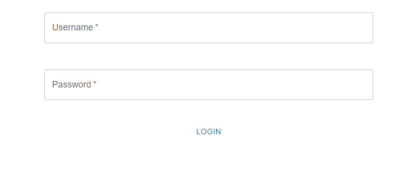

# fullstack-invoice

## Getting Started with `invoice-api`

1. First copy the contents of `invoice-api/.env.Example` into a file called `invoice-api/.env`, as this will serve as the connection string for Prisma to connect to our Postgres service that we will start with our docker compose file.

1. Next run `docker compose up` in the `/invoice-api` directory. You should see a message that the database is ready to accept connections. You should leave this terminal running.

1. Next you can run the command `npx prisma migrate dev --name "init"`, this should sync your postgres database with your Prisma types. This action should automatically run the seeds file and seed the database. If the database is not seeded that this point, you can manually run the seed script by running `npx prisma db seed`.

1. Install the required dependencies by running `npm i` in the `invoice-api` directory.

1. You can run the API in watch mode by entering the command `npm run start:dev`. Leave this terminal running while you continue to starting the front end of the application.

1. To test the `invoices/total` route, you can make a post request with the test user credentials: `{username: test123, password: password}`. You can use Insomnia or some other API tester and make the body the JSON credentials. Once you make a request to `POST http://localhost:3000/auth/login`, you will be returned a JWT. In Insomnia, put the token into the token field under the Bearer tab. After you have done this, you can make a request to `GET http://localhost:3000/invoices/total` and you should see a result like the following:

## Getting Started with `invoice-frontend`

1. First, run `npm i` in the `invoice-frontend` directory. After installing, run `npm run dev`.

1. When you visit `http://localhost:5173`, you should see only the login form, and if you try to visit `http://localhost:5173/invoices`, you will see a message that you are not authenticated.

1. Enter the username and password into the form to enter the site and see the invoices page. Again, the username is `test123` and the password is `password`.

1. Once you enter the username and password, you will now see the `/invoices` page.

1. You can click on any row and a details modal will pop up highlighting the details of that invoice.

1. You can click on the icon on the top right and the "logout" button from the dropdown to log out and return to an unauthenticated state.

1. See the following screenshots for a demonstration of the functionality:

## Additional Notes and Possible Additions

- In order to make authentication a little bit simpler, the passwords are being stored without hashing. To be more secure, the passwords could be hashed before storing using `bcrypt` and they can be decrypted during comparisons.

- Pagination could be added so that there is a better user experience when there is a larger dataset.

- More error handling and better status codes could be added to enhance the user experience as well.
