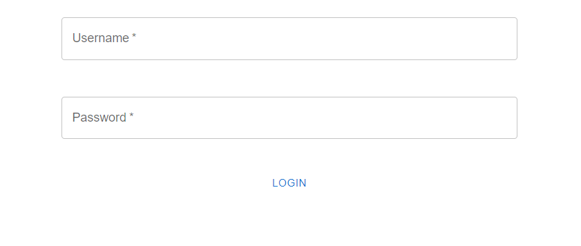

# Invoice Frontend

## Getting Started with `invoice-frontend`

1. First, run `npm i` in the `invoice-frontend` directory. After installing, run `npm run dev`.

1. When you visit `http://localhost:5173`, you should see only the login form, and if you try to visit `http://localhost:5173/invoices`, you will see a message that you are not authenticated.

1. Enter the username and password into the form to enter the site and see the invoices page. Again, the username is `test123` and the password is `password`.

1. Once you enter the username and password, you will now see the `/invoices` page.

1. You can click on any row and a details modal will pop up highlighting the details of that invoice.

1. You can click on the icon on the top right and the "logout" button from the dropdown to log out and return to an unauthenticated state.

1. See the following screenshots for a demonstration of the functionality:

